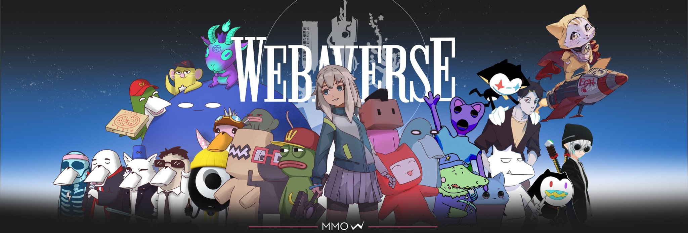

<p align="center">
    <a href="https://github.com/webaverse/app/graphs/contributors" alt="Contributors">
        </a>
    <a href="https://discord.gg/webaverse">
        </a>
    <a href="https://twitter.com/intent/follow?screen_name=webaverse">
        </a>
</p>


# Welcome To Webaverse
Webaverse is an open source web3 metaverse game engine that anyone can host. It runs in the browser, utilizes open tools and standards like ThreeJS and NodeJS and is super easy to use.

This repository holds all of the code for the core engine, server and front-end application. If you are looking to build applications for the open metaverse, you are probably in the right place.

#### Key Features

- A full-featured game engine running in your browser
- Infinite procedurally generated world
- Multiplayer with voice and chat
- AI-powered non-player characters
- Expressive, vocal and emotive avatars
- Runtime support for user uploads and custom apps
- Completely self-hostable


# Installation
Everything you need to get started with building on Webaverse is contained in this repo. 

**Important note:** This repo uses Git submodules. You need to install with the **--recurse-submodules** flag or installation will not work. Copy the code below to clone the repository if you aren't sure.

```sh
git clone --recurse-submodules https://github.com/webaverse/app.git
cd app/ # Go into the repository
git pull --recurse-submodules # Pull recursively
npm install # Install dependencies
```

## Quickstart
Provided you followed the instructions above, starting the application is as easy as

```sh
npm run dev
```

Once the server has started up, you can visit https://localhost:3000

#### Local Development With HTTPS

Your browser might throw an error if you don't have your certificates set up properly.

You can ignore it and continue by clicking "Advanced" in Chromium, or by typing 'thisisunsafe' directly into the window if you are on Chrome.

##### Better HTTPS Development Using Hosts File
A better option is to modify your hosts file. Instructions on how to do that are located [here](https://docs.webaverse.com/docs/engineering/setup-custom-host)

## Documentation
Webaverse user documentation is [here](https://webaverse.notion.site/User-Docs-3a36b223e39b4f94b3d1f6921a4c297a)

Documentation for Engineers and Technical Artists is [here](https://docs.webaverse.com/docs/index)


# Let's build it together!

We would love for you to come build with us. First, please review the documentation in it's entirety before contributing. Also join our [Discord](https://discord.gg/webaverse) and introduce yourself.

### New Issues and Features

Please search Github issues before reporting a new issue or starting a new feature. If you are starting a new feature or bug fix, please write up or reference an issue and indicate that you are working on it.

### Pull Requests

Please make sure your PRs change as little existing code as is necessary to prevent upstream merge conflicts. When posting a pull request, please document what the PR does and how it can be reviewed and QA'd. PRs will be reviewed and accepted if they conform to our linting and code conventions, don't cause any bugs and don't decrease performance of the app.

