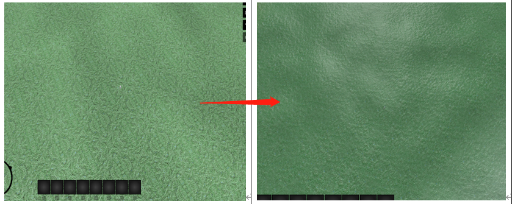
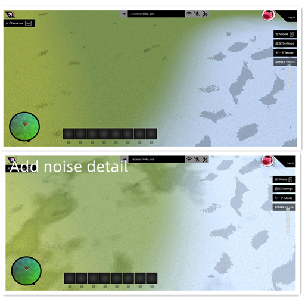

1.IdTech.js

* use Texture2D Array to load multiply textures in one;
* use Id to index texture,reduce use texture uniform
  
* loadAll  load all Under the same directory image file  

 


2.toonMaterial.js

* randomTexture ：

    texture random sampler

    

    . material  base on MeshToonMaterial

* USE_TERRAIN 
    material base on toonMaterial
    ```js
    exportconstterrainMaterial = newTHREE.MeshToonMaterial({    color:0xaaccff, gradientMap:gradientMaps.threeTone });;

    terrainMaterial.onBeforeCompile = (shader, renderer) => { 

        shader.defines = shader.defines || {};

        //open Terrain render
        shader.defines['USE_TERRAIN'] = '';
     ; 
    }
    ```

* add noise detail     
  

* Triplaner texture 
    ```glsl
        //triplanar Texture
        vec4 triplanarTexture(vec3 pos, vec3 normal,vec3    blending, float texId, sampler2DArray tex,float scale)  

        //triplanar normal 
        vec3 triplanarNormal(vec3 pos, vec3 normal,vec3     blending, float texId, sampler2DArray tex,float scale);
    
    ```

* stylized (toon)
    ```glsl
        //use gradientMap generate toon tone
        getGradientIrradiance()
    ```

final:
